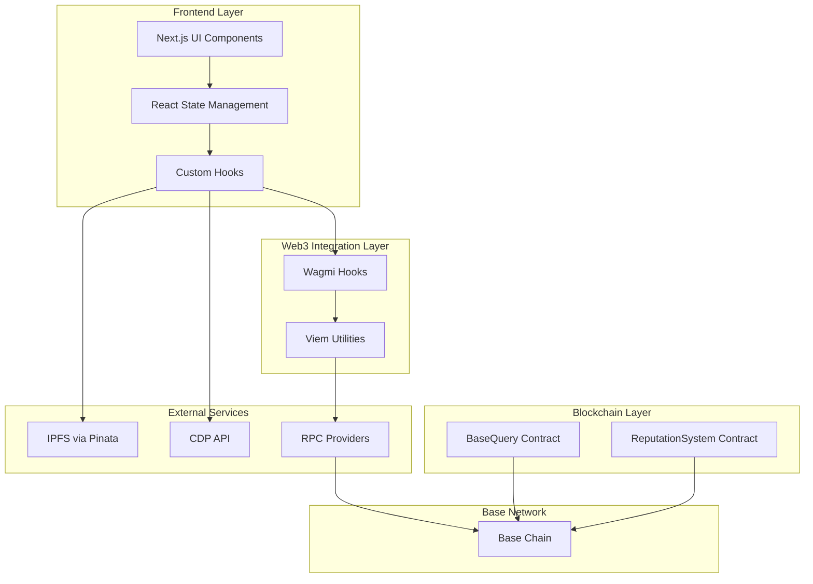

# Base Query – Decentralized Q\&A Platform 

Demo : https://base-query.vercel.app

Walkthrough : https://youtu.be/I-i8oMY3L5Q

**Base Query** is a decentralized Q\&A platform frontend built using **Next.js**, integrated with smart contracts on the **Base blockchain**. It enables developers to ask and answer technical questions with **USDC-based incentives**, leveraging on-chain reputation and governance.

This repository contains the web interface for interacting with the Base Query smart contracts.


## Key Features

* **Two Question Modes**:

  * *Bounty Questions*: Best answer chosen by the asker
  * *Prize Pool Questions*: Rewards distributed based on community votes

* **On-Chain Reputation System**:

  * Reputation gains/losses for asking, answering, voting
  * Reputation directly impacts platform privileges

* **USDC-Based Rewards**:

  * Real financial incentives for quality answers
  * Automated reward distribution via smart contracts

* **Anti-Spam Controls**:

  * Minimum ETH balance required to vote or answer
  * No self-voting or multiple answers per question

* **Seamless Web3 Experience**:

  * CDP wallet integration
  * IPFS-based content storage
  * MetaMask support


## Architecture Overview




## Smart Contract Addresses

* **Base Query**: [`0x37c98fC6109a79A2e6ade5719213f526D346B033`](https://sepolia.basescan.org/address/0x37c98fC6109a79A2e6ade5719213f526D346B033)
* **Reputation System**: [`0xeA8e3e5872E90E6437e6D836dEF8334f49F9e73f`](https://sepolia.basescan.org/address/0xeA8e3e5872E90E6437e6D836dEF8334f49F9e73f)


## Getting Started

### Prerequisites

* Node.js 18+
* npm or yarn
* Git

### Installation

```bash
git clone <your-repo-url>
cd base-query
npm install
```

### Environment Configuration

Create a `.env.local` file:

```env
NEXT_PUBLIC_PINATA_API_KEY
PINATA_SECRET_API_KEY
NEXT_PUBLIC_BASEQUERY_ADDRESS
NEXT_PUBLIC_REPUTATION_ADDRESS
NEXT_PUBLIC_GOOGLE_CLIENT_ID
NEXT_PUBLIC_GOOGLE_CLIENT_SECRET
NEXT_PUBLIC_AUTH_SECRET
NEXT_PUBLIC_CDP_API_KEY_ID
NEXT_PUBLIC_CDP_API_KEY_SECRET
NEXT_PUBLIC_CDP_WALLET_SECRET
NEXT_PUBLIC_PINATA_JWT
NEXT_PUBLIC_PINATA_GATEWAY
```

## Development

```bash
npm run dev
```

Runs the app in development mode on [http://localhost:3000](http://localhost:3000).

## Project Status

Base Query is deployed on **Base Sepolia** for testing and under active development. It includes a fully functional Q\&A flow with real token incentives and reputation management.

## Contribution

We welcome contributions. Please fork the repo, create a feature branch, and submit a pull request. Open issues if you encounter bugs or want to request features.


## License

MIT License

---

Let me know if you’d like a version that includes deployment instructions for Vercel or detailed frontend folder structure.
